# Tinkerdown

**Build data-driven apps with markdown**

<p align="center">
  
</p>

Tinkerdown is a CLI tool for creating interactive, data-driven applications using markdown files. Connect to databases, APIs, and files with zero boilerplate. Built on [LiveTemplate](https://github.com/livetemplate/livetemplate).

## Why Tinkerdown?

Tinkerdown replaces typical app scaffolding with a single markdown file — data sources in YAML, layout in markdown, interactions via HTML attributes.

- **One file = one app.** Data connections, layout, and interactions all live in one place. No build step, no node_modules, no boilerplate.
- **AI gets it right.** A single declarative file with no component tree or state management means less surface area for LLMs to misconfigure.
- **8 data sources out of the box.** SQLite, PostgreSQL, REST APIs, JSON, CSV, shell commands, markdown, and WASM. Point at existing infrastructure and get a working UI.
- **Start simple, add power as needed.** Plain markdown tables become editable grids. Add YAML frontmatter for databases, or drop to HTML + Go templates for full control.
- **Git-native and self-hosted.** Plain text in a repo. Version history, search, collaboration, offline access, no subscriptions.
- **Made for disposable software.** The admin panel for this sprint. The tracker for that hiring round. Software you'd never scaffold a React project for, but that's useful for days or weeks.

## Quick Start

```bash
# Install
go install github.com/livetemplate/tinkerdown/cmd/tinkerdown@latest

# Create a new app
tinkerdown new myapp
cd myapp

# Run the app
tinkerdown serve
# Open http://localhost:8080
```

## What You Can Build

Write a single markdown file with frontmatter configuration:

```markdown
---
title: Task Manager
sources:
  tasks:
    type: sqlite
    path: ./tasks.db
    query: SELECT * FROM tasks
---

# Task Manager

<table lvt-source="tasks" lvt-columns="title,status,due_date" lvt-actions="Complete,Delete">
</table>

<form lvt-submit="AddTask">
  <input name="title" placeholder="New task" required>
  <button type="submit">Add</button>
</form>
```

Run `tinkerdown serve` and get a fully interactive app with database persistence.

## Key Features

- **Single-file apps**: Everything in one markdown file with frontmatter
- **8 data sources**: SQLite, JSON, CSV, REST APIs, PostgreSQL, exec scripts, markdown, WASM
- **Auto-rendering**: Tables, selects, and lists generated from data
- **Real-time updates**: WebSocket-powered reactivity
- **Zero config**: `tinkerdown serve` just works
- **Hot reload**: Changes reflect immediately

## Data Sources

Define sources in your page's frontmatter:

```yaml
---
sources:
  tasks:
    type: sqlite
    path: ./tasks.db
    query: SELECT * FROM tasks

  users:
    type: rest
    from: https://api.example.com/users

  config:
    type: json
    path: ./_data/config.json
---
```

| Type | Description | Example |
|------|-------------|---------|
| `sqlite` | SQLite databases | [lvt-source-sqlite-test](examples/lvt-source-sqlite-test) |
| `json` | JSON files | [lvt-source-file-test](examples/lvt-source-file-test) |
| `csv` | CSV files | [lvt-source-file-test](examples/lvt-source-file-test) |
| `rest` | REST APIs | [lvt-source-rest-test](examples/lvt-source-rest-test) |
| `pg` | PostgreSQL | [lvt-source-pg-test](examples/lvt-source-pg-test) |
| `exec` | Shell commands | [lvt-source-exec-test](examples/lvt-source-exec-test) |
| `markdown` | Markdown files | [markdown-data-todo](examples/markdown-data-todo) |
| `wasm` | WASM modules | [lvt-source-wasm-test](examples/lvt-source-wasm-test) |

## Auto-Rendering

Generate HTML automatically from data sources:

```html
<!-- Table with actions -->
<table lvt-source="tasks" lvt-columns="title,status" lvt-actions="Edit,Delete">
</table>

<!-- Select dropdown -->
<select lvt-source="categories" lvt-value="id" lvt-label="name">
</select>

<!-- List -->
<ul lvt-source="items" lvt-field="name">
</ul>
```

See [Auto-Rendering Guide](docs/guides/auto-rendering.md) for full details.

## Interactive Attributes

| Attribute | Description |
|-----------|-------------|
| `lvt-source` | Connect element to a data source |
| `lvt-click` | Handle click events |
| `lvt-submit` | Handle form submissions |
| `lvt-change` | Handle input changes |
| `lvt-confirm` | Show confirmation dialog before action |
| `lvt-data-*` | Pass data with actions |

See [lvt-* Attributes Reference](docs/reference/lvt-attributes.md) for the complete list.

## Configuration

**Recommended:** Configure in frontmatter (single-file apps):

```markdown
---
title: My App
sources:
  tasks:
    type: sqlite
    path: ./tasks.db
    query: SELECT * FROM tasks
styling:
  theme: clean
---
```

**For complex apps:** Use `tinkerdown.yaml` for shared configuration:

```yaml
# tinkerdown.yaml - for multi-page apps with shared sources
server:
  port: 3000
sources:
  shared_data:
    type: rest
    from: ${API_URL}
    cache:
      ttl: 5m
```

See [Configuration Reference](docs/reference/config.md) for when to use each approach.

## AI-Assisted Development

Tinkerdown works great with AI assistants. Describe what you want:

```
Create a task manager with SQLite storage,
a table showing tasks with title/status/due date,
a form to add tasks, and delete buttons on each row.
```

See [AI Generation Guide](docs/guides/ai-generation.md) for tips on using Claude Code and other AI tools.

## Documentation

**Getting Started:**
- [Installation](docs/getting-started/installation.md)
- [Quickstart](docs/getting-started/quickstart.md)
- [Project Structure](docs/getting-started/project-structure.md)

**Guides:**
- [Data Sources](docs/guides/data-sources.md)
- [Auto-Rendering](docs/guides/auto-rendering.md)
- [Go Templates](docs/guides/go-templates.md)
- [AI Generation](docs/guides/ai-generation.md)

**Reference:**
- [CLI Commands](docs/reference/cli.md)
- [Frontmatter Options](docs/reference/frontmatter.md)
- [Configuration (tinkerdown.yaml)](docs/reference/config.md)
- [lvt-* Attributes](docs/reference/lvt-attributes.md)

**Planning:**
- [Roadmap](ROADMAP.md)

## Development

```bash
git clone https://github.com/livetemplate/tinkerdown.git
cd tinkerdown
go mod download
go test ./...
go build -o tinkerdown ./cmd/tinkerdown
```

## License

MIT

## Contributing

Contributions welcome! See [ROADMAP.md](ROADMAP.md) for planned features and current priorities.
