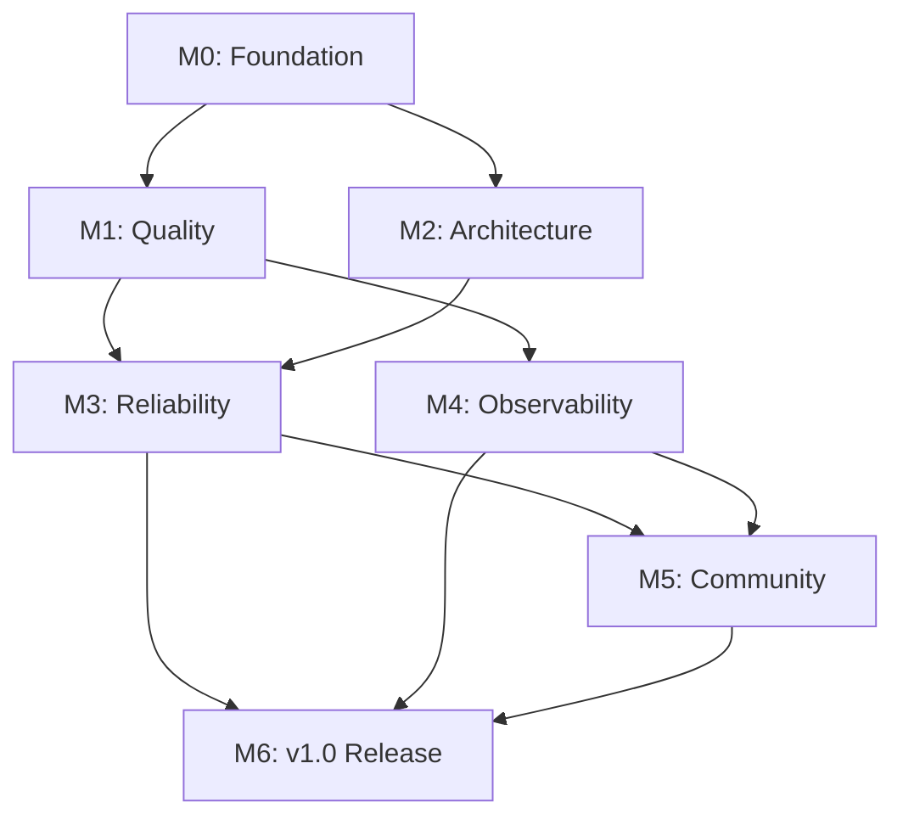

# Tinkerdown v1.0 Release Roadmap

> This document captures the comprehensive plan for improving code quality, architecture, and developer experience leading to the v1.0 release. Each section maps to a milestone, and each item can be converted to a GitHub issue.

## Document Purpose

This roadmap serves as:
1. **Analysis Summary**: Consolidated findings from static analysis and architecture review
2. **Issue Source**: Structured format for creating GitHub issues programmatically
3. **Release Plan**: Clear milestones with acceptance criteria for v1.0

---

## Release Timeline Overview

```
┌─────────────────────────────────────────────────────────────────────────┐
│                        TINKERDOWN v1.0 ROADMAP                          │
├─────────────────────────────────────────────────────────────────────────┤
│                                                                         │
│  M0: Foundation        M1: Quality       M2: Architecture               │
│  ───────────────       ──────────────    ────────────────               │
│  • CI/CD setup         • Test parallel   • Source registry              │
│  • Linting config      • Structured log  • Config unification           │
│  • Security scan       • Error handling  • API minimization             │
│  • Pre-commit hooks    • Doc coverage    • Complexity reduction         │
│                                                                         │
│  M3: Reliability       M4: Observtic     M5: Community                  │
│  ────────────────      ──────────────    ──────────────                 │
│  • Graceful shutdown   • Prometheus      • CONTRIBUTING.md              │
│  • Health endpoints    • Tracing hooks   • ARCHITECTURE.md              │
│  • Connection limits   • Error tracking  • Issue templates              │
│  • Circuit breaker     • Runbooks        • Example sources              │
│                                                                         │
│  M6: v1.0 Release                                                       │
│  ─────────────────                                                      │
│  • API stability                                                        │
│  • Performance bench                                                    │
│  • Security audit                                                       │
│  • Release automation                                                   │
│                                                                         │
└─────────────────────────────────────────────────────────────────────────┘
```

---

## Current State Analysis

### Codebase Metrics (Baseline)

| Metric | Current Value | Target (v1.0) |
|--------|---------------|---------------|
| Production LOC | 19,312 | - |
| Test LOC | 22,671 | - |
| Test-to-Code Ratio | 1.17 | > 1.0 |
| Test Functions | 459 | - |
| Tests with t.Parallel() | 1 (0.2%) | > 80% |
| Cyclomatic Complexity > 15 | ~12 functions | 0 |
| Exported Functions | 91 | < 50 |
| golangci-lint Issues | Not configured | 0 |
| Vulnerability Scan | Not configured | 0 critical/high |
| Structured Logging | 0% | 100% |

### Risk Assessment

| Area | Risk Level | Justification |
|------|------------|---------------|
| Security | Medium-High | exec.Command with shell, SQL string formatting |
| Maintainability | Medium | High complexity in websocket.go, page.go |
| Extensibility | Medium | Switch statements for type dispatch |
| Testability | Medium | Low parallelization, some coupling |
| Observability | High | No structured logging, no metrics |
| Community | Medium | Missing contribution guidelines |

---

## Milestone 0: Foundation (CI/CD & Tooling)

> **Goal**: Establish automated quality gates and development tooling
> **Estimated Issues**: 8
> **Priority**: Critical (blocks all other work)

### M0.1: Configure golangci-lint

**Issue Title**: `chore(ci): add golangci-lint configuration`

**Description**:
Create `.golangci.yml` with recommended linters for Go projects. This establishes consistent code style and catches common issues automatically.

**Acceptance Criteria**:
- [ ] `.golangci.yml` created with linters: errcheck, gosimple, govet, ineffassign, staticcheck, unused, gofmt, goimports, gosec, bodyclose, noctx
- [ ] `make lint` target added to Makefile
- [ ] All existing code passes linting (or issues documented)
- [ ] CI workflow updated to run golangci-lint

**Labels**: `tooling`, `ci`, `priority:critical`

**Files to Create/Modify**:
- `.golangci.yml` (new)
- `Makefile` (modify)
- `.github/workflows/ci.yml` (modify)

---

### M0.2: Add vulnerability scanning to CI

**Issue Title**: `security(ci): add govulncheck and dependency scanning`

**Description**:
Add automated vulnerability scanning to detect known CVEs in dependencies and code patterns.

**Acceptance Criteria**:
- [ ] govulncheck runs in CI pipeline
- [ ] Trivy or similar scans for dependency vulnerabilities
- [ ] CI fails on CRITICAL or HIGH severity findings
- [ ] `make security` target added for local scanning

**Labels**: `security`, `ci`, `priority:critical`

**Current State**:
- No vulnerability scanning configured
- No Dependabot or Renovate for dependency updates

---

### M0.3: Configure pre-commit hooks

**Issue Title**: `chore(dx): add pre-commit hooks for code quality`

**Description**:
Set up pre-commit hooks to catch issues before they reach CI, improving developer feedback loop.

**Acceptance Criteria**:
- [ ] `.pre-commit-config.yaml` created
- [ ] Hooks: trailing-whitespace, end-of-file-fixer, check-yaml, golangci-lint, go-test-short
- [ ] Documentation in README for setup
- [ ] Works with both pre-commit framework and git hooks directly

**Labels**: `tooling`, `dx`, `priority:high`

---

### M0.4: Add code coverage tracking

**Issue Title**: `chore(ci): integrate code coverage with Codecov`

**Description**:
Track code coverage trends over time and display badge in README.

**Acceptance Criteria**:
- [ ] Coverage uploaded to Codecov (or Coveralls)
- [ ] Coverage badge added to README
- [ ] PR comments show coverage diff
- [ ] Minimum coverage threshold configured (suggest: 60%)

**Labels**: `ci`, `testing`, `priority:medium`

**Current State**:
- Coverage generated locally (`coverage.out`)
- Not uploaded or tracked over time

---

### M0.5: Set up automated releases with GoReleaser

**Issue Title**: `chore(release): configure GoReleaser for multi-platform builds`

**Description**:
Automate release process with cross-platform binary builds, checksums, and changelog generation.

**Acceptance Criteria**:
- [ ] `.goreleaser.yaml` configured
- [ ] Builds for linux/darwin/windows on amd64/arm64
- [ ] GitHub release created on tag push
- [ ] Checksums and signatures generated
- [ ] Changelog auto-generated from commits

**Labels**: `tooling`, `release`, `priority:medium`

---

### M0.6: Add Docker support

**Issue Title**: `chore(deploy): add Dockerfile and docker-compose`

**Description**:
Enable containerized deployment for easier testing and production use.

**Acceptance Criteria**:
- [ ] Multi-stage Dockerfile (build + runtime)
- [ ] Image size < 50MB (scratch/distroless base)
- [ ] docker-compose.yml for local development with examples
- [ ] CI builds and pushes to ghcr.io on release

**Labels**: `deployment`, `dx`, `priority:low`

---

### M0.7: Create Makefile quality target

**Issue Title**: `chore(dx): add comprehensive Makefile quality targets`

**Description**:
Consolidate all quality checks into easy-to-use Makefile targets.

**Acceptance Criteria**:
- [ ] `make quality` runs all checks (lint, vet, test, security)
- [ ] `make tools` installs all required tools
- [ ] `make check` for quick pre-commit validation
- [ ] `make ci` mirrors CI pipeline locally
- [ ] Targets documented in Makefile header

**Labels**: `tooling`, `dx`, `priority:high`

**Proposed Makefile additions**:
```makefile
.PHONY: tools quality check ci

tools:
	go install github.com/golangci/golangci-lint/cmd/golangci-lint@latest
	go install golang.org/x/vuln/cmd/govulncheck@latest
	go install github.com/securego/gosec/v2/cmd/gosec@latest

quality: lint vet test security

check: fmt vet test-short

ci: lint test-race security

security:
	govulncheck ./...
	gosec -quiet ./...

test-race:
	go test -race -coverprofile=coverage.out ./...
```

---

### M0.8: Add GitHub issue and PR templates

**Issue Title**: `chore(community): add issue and PR templates`

**Description**:
Standardize issue and PR submissions for better triage and review.

**Acceptance Criteria**:
- [ ] Bug report template with reproduction steps
- [ ] Feature request template with use case
- [ ] PR template with checklist
- [ ] Templates include labels suggestions

**Labels**: `community`, `documentation`, `priority:medium`

---

## Milestone 1: Code Quality

> **Goal**: Improve test quality, logging, error handling, and documentation
> **Estimated Issues**: 10
> **Priority**: High

### M1.1: Add t.Parallel() to all tests

**Issue Title**: `test: enable parallel test execution across all packages`

**Description**:
Currently only 1 of 459 tests uses `t.Parallel()`. This significantly slows CI and hides potential race conditions.

**Current State**:
- Tests with t.Parallel(): 1 (0.2%)
- Total test functions: 459
- Table-driven tests: 87
- Tests with t.Run(): 176

**Acceptance Criteria**:
- [ ] All independent tests marked with `t.Parallel()`
- [ ] Subtests in table-driven tests use `t.Parallel()`
- [ ] Tests that cannot be parallel documented with reason
- [ ] CI time reduced by > 30%
- [ ] `go test -race` passes

**Labels**: `testing`, `performance`, `priority:critical`

**Implementation Notes**:
```go
// Pattern for table-driven tests
func TestExample(t *testing.T) {
    t.Parallel()
    tests := []struct{...}
    for _, tt := range tests {
        tt := tt // capture range variable
        t.Run(tt.name, func(t *testing.T) {
            t.Parallel()
            // test body
        })
    }
}
```

**Files to Modify**: All `*_test.go` files (55 files)

---

### M1.2: Migrate to structured logging (slog)

**Issue Title**: `refactor: migrate from log.Printf to slog structured logging`

**Description**:
Replace unstructured `log.Printf` calls with Go 1.21+ `slog` for better observability.

**Current State**:
- log.Printf/Println usage: 95 calls
- fmt.Printf/Println (output): 121 calls
- slog usage: 0

**Acceptance Criteria**:
- [ ] Create `internal/logging` package with slog configuration
- [ ] Support JSON and text output formats
- [ ] Support log levels via config/env (DEBUG, INFO, WARN, ERROR)
- [ ] Replace all `log.Printf` with structured `slog` calls
- [ ] Add request ID / correlation ID support
- [ ] CLI output remains user-friendly (text format by default)

**Labels**: `refactor`, `observability`, `priority:critical`

**Implementation Pattern**:
```go
// Before
log.Printf("[WebSocket] Connection from %s for page %s", addr, pageID)

// After
slog.Info("websocket connection established",
    "component", "websocket",
    "remote_addr", addr,
    "page_id", pageID,
)
```

---

### M1.3: Improve error handling consistency

**Issue Title**: `refactor: standardize error wrapping and handling patterns`

**Description**:
Ensure all errors are wrapped with context and handled consistently.

**Current State**:
- Errors wrapped with %w: 114 (71%)
- Bare error returns: 47 (29%)
- Unchecked Close() errors: ~10 locations

**Acceptance Criteria**:
- [ ] All errors wrapped with `fmt.Errorf("context: %w", err)`
- [ ] Create error helper for Close() operations
- [ ] Define sentinel errors in `errors.go` for common cases
- [ ] errcheck linter passes with no exclusions

**Labels**: `refactor`, `reliability`, `priority:high`

**Helper to Create**:
```go
// internal/errors/close.go
func CloseWithLog(c io.Closer, logger *slog.Logger, name string) {
    if err := c.Close(); err != nil {
        logger.Warn("failed to close resource",
            "resource", name,
            "error", err,
        )
    }
}
```

---

### M1.4: Add godoc comments to exported APIs

**Issue Title**: `docs: add documentation comments to all exported types and functions`

**Description**:
Ensure all exported APIs have proper godoc comments for go doc and pkg.go.dev.

**Current State**:
- Exported functions: 91
- Exported types: 133
- Missing doc comments: ~40%

**Acceptance Criteria**:
- [ ] All exported functions have doc comments
- [ ] All exported types have doc comments
- [ ] All exported constants/variables have doc comments
- [ ] Package-level doc in each package's doc.go
- [ ] Examples added for key APIs

**Labels**: `documentation`, `api`, `priority:medium`

---

### M1.5: Add interface compliance checks

**Issue Title**: `test: add compile-time interface compliance verification`

**Description**:
Add `var _ Interface = (*Implementation)(nil)` checks to catch interface drift.

**Current State**:
- No interface compliance checks found

**Acceptance Criteria**:
- [ ] All Source implementations verified against Source interface
- [ ] All WritableSource implementations verified
- [ ] All Output implementations verified
- [ ] Checks added in implementation files (not test files)

**Labels**: `testing`, `reliability`, `priority:medium`

**Pattern**:
```go
// internal/source/rest.go
var (
    _ Source = (*RestSource)(nil)
    _ io.Closer = (*RestSource)(nil)
)
```

---

### M1.6: Create source contract tests

**Issue Title**: `test: add contract tests for Source interface implementations`

**Description**:
Create shared test suite that all Source implementations must pass.

**Acceptance Criteria**:
- [ ] Contract tests for Source interface (Name, Fetch, Close)
- [ ] Contract tests for WritableSource interface (Add, Update, Delete)
- [ ] Contract tests for SQLExecutor interface
- [ ] Each implementation runs contract tests
- [ ] Tests verify idempotent Close()

**Labels**: `testing`, `architecture`, `priority:medium`

**Implementation**:
```go
// internal/source/contract_test.go
func RunSourceContractTests(t *testing.T, factory func() Source) {
    t.Run("Name returns non-empty string", func(t *testing.T) {...})
    t.Run("Fetch returns valid data or error", func(t *testing.T) {...})
    t.Run("Close is idempotent", func(t *testing.T) {...})
    t.Run("Context cancellation respected", func(t *testing.T) {...})
}
```

---

### M1.7: Fix SQL string formatting security issue

**Issue Title**: `security: validate table names to prevent SQL injection`

**Description**:
Table names are interpolated directly into SQL queries. While they come from config, this pattern is risky.

**Current State** (internal/source/sqlite.go):
```go
query := fmt.Sprintf("SELECT * FROM %s ORDER BY...", s.table)  // Line 92
query := fmt.Sprintf("INSERT INTO %s (%s)...", s.table, ...)   // Line 213
query := fmt.Sprintf("UPDATE %s SET...", s.table, ...)         // Line 252
query := fmt.Sprintf("DELETE FROM %s...", s.table)             // Line 270
```

**Acceptance Criteria**:
- [ ] Table names validated against allowlist pattern `^[a-zA-Z_][a-zA-Z0-9_]*$`
- [ ] Column names validated similarly
- [ ] Validation happens at source creation time
- [ ] Clear error message on invalid names
- [ ] Same pattern applied to PostgreSQL source

**Labels**: `security`, `priority:critical`

---

### M1.8: Secure exec.Command usage

**Issue Title**: `security: replace shell execution with direct command execution`

**Description**:
Commands are executed via `sh -c` which allows shell injection. Use direct execution with parsed arguments.

**Current State**:
```go
// internal/server/webhook.go:713
cmd := exec.CommandContext(ctx, "sh", "-c", cmdStr)

// internal/runtime/actions.go:606
cmd := exec.CommandContext(ctx, "sh", "-c", cmdStr)
```

**Acceptance Criteria**:
- [ ] Parse commands into executable and arguments
- [ ] Execute directly without shell wrapper
- [ ] Document cases where shell is required
- [ ] Add allowlist for permitted executables (optional)
- [ ] Log all command executions for audit

**Labels**: `security`, `priority:high`

---

### M1.9: Reduce cyclomatic complexity in critical files

**Issue Title**: `refactor: reduce complexity in websocket.go and page.go`

**Description**:
Several files have high cyclomatic complexity making them hard to maintain and test.

**High Complexity Files**:
| File | Branch Ratio | Action |
|------|--------------|--------|
| internal/server/websocket.go | 0.19 | Split into multiple types |
| page.go | 0.18 | Extract parsing helpers |
| internal/runtime/state.go | 0.20 | Extract action handlers |
| internal/runtime/actions.go | 0.19 | Use command pattern |

**Acceptance Criteria**:
- [ ] No function exceeds cyclomatic complexity of 15
- [ ] websocket.go split into: ConnectionManager, StateManager, ActionDispatcher
- [ ] Large switch statements extracted to strategy/registry patterns
- [ ] Test coverage maintained or improved

**Labels**: `refactor`, `maintainability`, `priority:medium`

---

### M1.10: Track and resolve TODOs

**Issue Title**: `chore: audit and resolve TODO comments in production code`

**Description**:
Production code contains TODO comments that should be tracked as issues.

**Current TODOs**:
```
./state.go:133          TODO: implement with livetemplate integration
./state.go:169          TODO: Implement livetemplate integration
./internal/server/server.go:377   TODO: Add WebSocket support
./internal/server/server.go:2077  TODO: Enhance markdown parser
./internal/blocks/registry.go:6   TODO: Implement block type registration
./internal/wasm/source.go:33      TODO: Implement proper memory allocation
./internal/markdown/parser.go:6   TODO: Implement markdown parsing
./parser.go:724                   TODO: Implement multi-file parsing
```

**Acceptance Criteria**:
- [ ] Each TODO converted to GitHub issue
- [ ] TODOs in code reference issue number
- [ ] Critical TODOs scheduled for v1.0
- [ ] Non-critical TODOs labeled for future

**Labels**: `tech-debt`, `priority:low`

---

## Milestone 2: Architecture Improvements

> **Goal**: Improve extensibility, reduce duplication, minimize API surface
> **Estimated Issues**: 8
> **Priority**: High

### M2.1: Implement source registry pattern

**Issue Title**: `refactor(source): replace switch statement with registry pattern`

**Description**:
The current source creation uses a large switch statement that must be modified for each new source type. Implement a registry pattern for better extensibility.

**Current State** (internal/source/source.go:143-174):
```go
func createSource(name string, cfg config.SourceConfig, ...) (Source, error) {
    switch cfg.Type {
    case "exec": ...
    case "pg": ...
    case "rest": ...
    case "sqlite": ...
    // 8+ cases
    }
}
```

**Acceptance Criteria**:
- [ ] Create `SourceFactory` function type
- [ ] Create `RegisterSourceType(name string, factory SourceFactory)`
- [ ] Each source self-registers in `init()`
- [ ] Switch statement replaced with registry lookup
- [ ] Error for unknown source types includes available types
- [ ] Documentation for adding new source types

**Labels**: `architecture`, `extensibility`, `priority:high`

**Implementation**:
```go
// internal/source/registry.go
type SourceFactory func(name string, cfg config.SourceConfig, siteDir, currentFile string) (Source, error)

var (
    factoryMu  sync.RWMutex
    factories  = make(map[string]SourceFactory)
)

func RegisterSourceType(typeName string, factory SourceFactory) {
    factoryMu.Lock()
    defer factoryMu.Unlock()
    factories[typeName] = factory
}

func createSource(name string, cfg config.SourceConfig, siteDir, currentFile string) (Source, error) {
    factoryMu.RLock()
    factory, ok := factories[cfg.Type]
    factoryMu.RUnlock()

    if !ok {
        return nil, &UnsupportedSourceError{Type: cfg.Type, Available: availableTypes()}
    }
    return factory(name, cfg, siteDir, currentFile)
}
```

---

### M2.2: Unify SourceConfig types

**Issue Title**: `refactor(config): unify duplicate SourceConfig type definitions`

**Description**:
Two parallel type hierarchies exist for source configuration, requiring manual conversion.

**Current State**:
- `tinkerdown.SourceConfig` in root package (from frontmatter)
- `config.SourceConfig` in internal/config (from tinkerdown.yaml)
- Manual field-by-field conversion in websocket.go:265-282

**Acceptance Criteria**:
- [ ] Single canonical `SourceConfig` type in internal/config
- [ ] Root package re-exports or embeds the type
- [ ] Remove manual conversion code
- [ ] Ensure YAML and frontmatter parsing still work
- [ ] Update all usages

**Labels**: `architecture`, `maintainability`, `priority:high`

---

### M2.3: Create shared HTTP client factory

**Issue Title**: `refactor: extract HTTP client creation to shared factory`

**Description**:
HTTP clients are created identically in 7+ locations with hardcoded timeouts.

**Current Locations**:
- internal/output/slack.go:58,82,103
- internal/server/webhook.go:668
- internal/source/graphql.go:112
- internal/source/rest.go:115
- internal/runtime/actions.go:535

**Acceptance Criteria**:
- [ ] Create `internal/httputil/client.go`
- [ ] Configurable timeouts with sensible defaults
- [ ] Connection pooling configured properly
- [ ] Replace all inline client creation
- [ ] Add option for custom transport (testing)

**Labels**: `refactor`, `duplication`, `priority:medium`

---

### M2.4: Extract header parsing utility

**Issue Title**: `refactor: extract duplicate header parsing logic`

**Description**:
REST and GraphQL sources have identical ~30 line header parsing blocks.

**Acceptance Criteria**:
- [ ] Create `internal/source/headers.go`
- [ ] Support both new YAML map format and legacy options
- [ ] Environment variable expansion
- [ ] Reuse in rest.go, graphql.go, and webhook.go

**Labels**: `refactor`, `duplication`, `priority:low`

---

### M2.5: Create reliability wrapper for sources

**Issue Title**: `refactor: extract retry/circuit-breaker to composable wrapper`

**Description**:
Retry and circuit breaker configuration is duplicated across REST, GraphQL, and Postgres sources.

**Acceptance Criteria**:
- [ ] Create `ReliableSource` wrapper type
- [ ] Compose retry and circuit breaker behavior
- [ ] Apply to all network-based sources
- [ ] Configurable via source config
- [ ] Metrics/logging for retry attempts

**Labels**: `refactor`, `reliability`, `priority:medium`

---

### M2.6: Split WebSocketHandler responsibilities

**Issue Title**: `refactor(server): decompose WebSocketHandler into focused components`

**Description**:
WebSocketHandler (950+ lines) handles too many responsibilities: connection management, state factory, template rendering, action execution, expression evaluation.

**Acceptance Criteria**:
- [ ] Extract `ConnectionManager` for WebSocket lifecycle
- [ ] Extract `StateManager` for state factories and instances
- [ ] Extract `ActionDispatcher` for action routing
- [ ] Extract `ExpressionEvaluator` for expression handling
- [ ] WebSocketHandler becomes thin coordinator
- [ ] Each component independently testable

**Labels**: `refactor`, `architecture`, `priority:medium`

---

### M2.7: Minimize public API surface

**Issue Title**: `refactor(api): reduce exported types in root package`

**Description**:
The root package exports 91 functions and 133 types. Many are internal implementation details.

**Acceptance Criteria**:
- [ ] Audit all exports for necessity
- [ ] Move internal types to internal/ packages
- [ ] Use interfaces for public API where possible
- [ ] Document public API in package doc
- [ ] Target: < 50 exported functions, < 30 exported types

**Labels**: `architecture`, `api`, `priority:medium`

---

### M2.8: Apply output registry pattern

**Issue Title**: `refactor(output): apply registry pattern to notification outputs`

**Description**:
Similar to sources, outputs use a switch statement for type dispatch.

**Acceptance Criteria**:
- [ ] Create `OutputFactory` and registry
- [ ] Self-registration for Slack, Email outputs
- [ ] Document adding new output types
- [ ] Consistent with source registry pattern

**Labels**: `architecture`, `extensibility`, `priority:low`

---

## Milestone 3: Reliability & Resilience

> **Goal**: Production-ready reliability features
> **Estimated Issues**: 6
> **Priority**: High

### M3.1: Implement graceful shutdown

**Issue Title**: `feat(server): add graceful shutdown with connection draining`

**Description**:
Server currently does not handle SIGTERM/SIGINT gracefully, potentially dropping in-flight requests.

**Acceptance Criteria**:
- [ ] Catch SIGINT and SIGTERM signals
- [ ] Stop accepting new connections
- [ ] Drain existing connections with timeout (30s default)
- [ ] Close WebSocket connections gracefully
- [ ] Close database connections
- [ ] Log shutdown progress

**Labels**: `reliability`, `server`, `priority:critical`

**Implementation**:
```go
func (s *Server) ListenAndServe(addr string) error {
    srv := &http.Server{
        Addr:         addr,
        Handler:      s,
        ReadTimeout:  15 * time.Second,
        WriteTimeout: 15 * time.Second,
        IdleTimeout:  60 * time.Second,
    }

    shutdownCh := make(chan os.Signal, 1)
    signal.Notify(shutdownCh, syscall.SIGINT, syscall.SIGTERM)

    go func() {
        <-shutdownCh
        ctx, cancel := context.WithTimeout(context.Background(), 30*time.Second)
        defer cancel()

        slog.Info("shutting down server")
        srv.Shutdown(ctx)
    }()

    return srv.ListenAndServe()
}
```

---

### M3.2: Add health check endpoints

**Issue Title**: `feat(server): add /health and /ready endpoints`

**Description**:
No health check endpoints exist for load balancer or orchestrator integration.

**Acceptance Criteria**:
- [ ] `/health` - basic liveness (always 200 if process running)
- [ ] `/ready` - readiness (checks database, cache, etc.)
- [ ] JSON response with component status
- [ ] Configurable endpoint paths
- [ ] Option to disable (for security)

**Labels**: `reliability`, `observability`, `priority:high`

---

### M3.3: Add connection limits

**Issue Title**: `feat(server): add configurable connection limits`

**Description**:
No limits on WebSocket connections could lead to resource exhaustion.

**Acceptance Criteria**:
- [ ] Max concurrent WebSocket connections (default: 1000)
- [ ] Max connections per IP (default: 10)
- [ ] Graceful rejection with 503 status
- [ ] Metrics for connection counts
- [ ] Configurable via tinkerdown.yaml

**Labels**: `reliability`, `security`, `priority:medium`

---

### M3.4: Make database pool configurable

**Issue Title**: `feat(source): make database connection pool configurable`

**Description**:
PostgreSQL pool is hardcoded to 5 connections.

**Current State** (internal/source/postgres.go):
```go
db.SetMaxOpenConns(5)  // Hardcoded
```

**Acceptance Criteria**:
- [ ] Pool size configurable in source config
- [ ] Sensible defaults (max: 25, idle: 5)
- [ ] Connection timeout configurable
- [ ] Health check for connections
- [ ] Apply to both Postgres and SQLite

**Labels**: `reliability`, `configuration`, `priority:medium`

---

### M3.5: Add HTTP server timeouts

**Issue Title**: `security(server): add HTTP server timeout configuration`

**Description**:
HTTP server may be vulnerable to slowloris attacks without proper timeouts.

**Acceptance Criteria**:
- [ ] ReadTimeout: 15s (configurable)
- [ ] WriteTimeout: 15s (configurable)
- [ ] IdleTimeout: 60s (configurable)
- [ ] ReadHeaderTimeout: 5s
- [ ] Document timeout configuration

**Labels**: `security`, `reliability`, `priority:high`

---

### M3.6: Add per-IP rate limiting

**Issue Title**: `security(server): add per-IP rate limiting middleware`

**Description**:
Current rate limiting is global only, not per-client.

**Acceptance Criteria**:
- [ ] Per-IP rate limiting (default: 100 req/min)
- [ ] Configurable limits per endpoint
- [ ] Exempt list for trusted IPs
- [ ] Clear rate limit headers (X-RateLimit-*)
- [ ] Proper 429 response

**Labels**: `security`, `reliability`, `priority:medium`

---

## Milestone 4: Observability

> **Goal**: Production-grade monitoring and debugging capabilities
> **Estimated Issues**: 5
> **Priority**: Medium

### M4.1: Add Prometheus metrics

**Issue Title**: `feat(observability): add Prometheus metrics endpoint`

**Description**:
No metrics collection for monitoring request rates, latencies, or resource usage.

**Metrics to Add**:
- `tinkerdown_http_requests_total{method,path,status}`
- `tinkerdown_http_request_duration_seconds{method,path}`
- `tinkerdown_websocket_connections{state}`
- `tinkerdown_source_fetch_duration_seconds{source,type}`
- `tinkerdown_source_fetch_errors_total{source,type}`
- `tinkerdown_cache_hits_total{result}`
- `tinkerdown_active_pages`

**Acceptance Criteria**:
- [ ] `/metrics` endpoint (Prometheus format)
- [ ] Request duration histogram
- [ ] WebSocket connection gauge
- [ ] Source operation metrics
- [ ] Cache hit/miss counters
- [ ] Configurable to disable

**Labels**: `observability`, `monitoring`, `priority:high`

---

### M4.2: Add request tracing hooks

**Issue Title**: `feat(observability): add OpenTelemetry tracing support`

**Description**:
Add distributed tracing support for debugging request flows.

**Acceptance Criteria**:
- [ ] OpenTelemetry SDK integration
- [ ] Trace ID propagation in logs
- [ ] Span creation for key operations
- [ ] Configurable exporter (stdout, Jaeger, OTLP)
- [ ] Sampling configuration
- [ ] Off by default

**Labels**: `observability`, `tracing`, `priority:low`

---

### M4.3: Add structured error tracking

**Issue Title**: `feat(observability): add error aggregation and reporting`

**Description**:
Errors are logged but not aggregated or tracked for patterns.

**Acceptance Criteria**:
- [ ] Error type categorization
- [ ] Stack trace capture
- [ ] Error rate metrics
- [ ] Optional Sentry integration
- [ ] Error context (request ID, page, source)

**Labels**: `observability`, `reliability`, `priority:medium`

---

### M4.4: Create operational runbook

**Issue Title**: `docs: create operational runbook for production deployment`

**Description**:
Document common operational procedures and troubleshooting.

**Sections**:
- Deployment checklist
- Configuration reference
- Health check interpretation
- Common issues and solutions
- Performance tuning
- Backup and recovery

**Acceptance Criteria**:
- [ ] `docs/operations/RUNBOOK.md` created
- [ ] All config options documented
- [ ] Troubleshooting decision tree
- [ ] Performance tuning guide
- [ ] Monitoring alert recommendations

**Labels**: `documentation`, `operations`, `priority:medium`

---

### M4.5: Add debug mode with verbose logging

**Issue Title**: `feat(dx): add debug mode with request/response logging`

**Description**:
Add verbose debug mode for development and troubleshooting.

**Acceptance Criteria**:
- [ ] `--debug` flag enables verbose logging
- [ ] Log all HTTP requests/responses (headers, body summary)
- [ ] Log all WebSocket messages
- [ ] Log source queries and results
- [ ] Log template rendering times
- [ ] Pretty-printed output for terminal

**Labels**: `dx`, `observability`, `priority:low`

---

## Milestone 5: Community & Documentation

> **Goal**: Make the project welcoming and easy to contribute to
> **Estimated Issues**: 7
> **Priority**: Medium

### M5.1: Create CONTRIBUTING.md

**Issue Title**: `docs: create comprehensive contribution guide`

**Description**:
No contribution guidelines exist for community contributors.

**Sections**:
- Quick start for contributors
- Development environment setup
- Code style and conventions
- Testing requirements
- PR process and expectations
- Adding new source types (tutorial)
- Adding new output types (tutorial)

**Acceptance Criteria**:
- [ ] CONTRIBUTING.md in repository root
- [ ] Links from README
- [ ] Clear first-time contributor path
- [ ] Code of conduct reference

**Labels**: `documentation`, `community`, `priority:high`

---

### M5.2: Create ARCHITECTURE.md

**Issue Title**: `docs: create architecture overview document`

**Description**:
Document the system architecture for new contributors and maintainers.

**Sections**:
- System overview diagram
- Package responsibilities
- Data flow (request lifecycle)
- Key abstractions (Source, Output, State)
- Extension points
- Design decisions and trade-offs

**Acceptance Criteria**:
- [ ] docs/ARCHITECTURE.md created
- [ ] Includes diagrams (Mermaid)
- [ ] Links to relevant code
- [ ] Updated when architecture changes

**Labels**: `documentation`, `architecture`, `priority:high`

---

### M5.3: Add Architecture Decision Records (ADRs)

**Issue Title**: `docs: establish ADR process and document key decisions`

**Description**:
Document significant architectural decisions for future reference.

**Initial ADRs**:
- ADR-001: Source registry pattern
- ADR-002: Structured logging with slog
- ADR-003: WebSocket message protocol
- ADR-004: Configuration hierarchy

**Acceptance Criteria**:
- [ ] ADR template in docs/decisions/
- [ ] Initial ADRs for existing decisions
- [ ] Process for proposing new ADRs
- [ ] Index of all ADRs

**Labels**: `documentation`, `architecture`, `priority:medium`

---

### M5.4: Create source type template

**Issue Title**: `docs: add template and guide for new source implementations`

**Description**:
Make it easy for contributors to add new data source types.

**Acceptance Criteria**:
- [ ] Template file: `internal/source/template_source.go.example`
- [ ] Step-by-step guide in CONTRIBUTING.md
- [ ] Required interface methods documented
- [ ] Testing requirements documented
- [ ] Example PR for reference

**Labels**: `documentation`, `community`, `priority:medium`

---

### M5.5: Add examples for all source types

**Issue Title**: `docs: ensure examples exist for all source types`

**Description**:
Each source type should have a working example in the examples directory.

**Current Examples**:
Review and ensure coverage for: exec, pg, rest, sqlite, json, csv, markdown, wasm, graphql

**Acceptance Criteria**:
- [ ] Example for each source type
- [ ] Examples are tested in CI
- [ ] README in examples directory
- [ ] Examples demonstrate key features

**Labels**: `documentation`, `examples`, `priority:low`

---

### M5.6: Improve README with badges and quick start

**Issue Title**: `docs: enhance README with badges, examples, and clear quick start`

**Description**:
Improve first impression and discoverability.

**Additions**:
- Build status badge
- Coverage badge
- Go Report Card badge
- License badge
- Quick start (< 5 minutes)
- Feature highlights
- Comparison with alternatives

**Acceptance Criteria**:
- [ ] All badges added and working
- [ ] 3-step quick start
- [ ] GIF/video demo (optional)
- [ ] Clear value proposition
- [ ] Links to documentation

**Labels**: `documentation`, `community`, `priority:medium`

---

### M5.7: Set up GitHub Discussions

**Issue Title**: `chore(community): enable and configure GitHub Discussions`

**Description**:
Enable community Q&A and idea sharing separate from issues.

**Categories**:
- Q&A (questions and answers)
- Ideas (feature suggestions)
- Show and Tell (community projects)
- General (anything else)

**Acceptance Criteria**:
- [ ] Discussions enabled
- [ ] Categories configured
- [ ] Welcome post created
- [ ] Link in README

**Labels**: `community`, `priority:low`

---

## Milestone 6: v1.0 Release

> **Goal**: Stable, production-ready release
> **Estimated Issues**: 6
> **Priority**: Critical (final milestone)

### M6.1: API stability review

**Issue Title**: `chore(api): review and lock public API for v1.0`

**Description**:
Review all exported APIs and commit to stability guarantees.

**Acceptance Criteria**:
- [ ] All exports reviewed for necessity
- [ ] Deprecated APIs marked or removed
- [ ] API documented with examples
- [ ] Compatibility policy documented
- [ ] No breaking changes without major version

**Labels**: `api`, `release`, `priority:critical`

---

### M6.2: Performance benchmarking

**Issue Title**: `test: establish performance baselines with benchmarks`

**Description**:
Create benchmarks for critical paths and establish performance baselines.

**Benchmarks Needed**:
- Markdown parsing throughput
- Source fetching latency
- Template rendering time
- WebSocket message handling
- Action execution

**Acceptance Criteria**:
- [ ] Benchmarks for all critical paths
- [ ] Baseline numbers documented
- [ ] Benchmarks run in CI (no regression check)
- [ ] Memory allocation benchmarks
- [ ] Comparison with alternatives (optional)

**Labels**: `performance`, `testing`, `priority:medium`

---

### M6.3: Security audit

**Issue Title**: `security: conduct security review before v1.0`

**Description**:
Review security posture and address any findings.

**Areas to Review**:
- Input validation
- Authentication/authorization
- Injection vulnerabilities
- Secrets handling
- Dependency vulnerabilities
- CORS and CSP

**Acceptance Criteria**:
- [ ] All HIGH/CRITICAL findings addressed
- [ ] gosec passes with no warnings
- [ ] govulncheck clean
- [ ] Security considerations documented
- [ ] Responsible disclosure process in place

**Labels**: `security`, `release`, `priority:critical`

---

### M6.4: Documentation completeness

**Issue Title**: `docs: ensure documentation completeness for v1.0`

**Description**:
All documentation must be complete and accurate.

**Documentation Checklist**:
- [ ] README quick start works
- [ ] All config options documented
- [ ] All source types documented
- [ ] All CLI commands documented
- [ ] API reference complete
- [ ] Troubleshooting guide
- [ ] Migration guide (if applicable)

**Labels**: `documentation`, `release`, `priority:high`

---

### M6.5: Release automation

**Issue Title**: `chore(release): automate v1.0 release process`

**Description**:
Ensure release process is fully automated and tested.

**Acceptance Criteria**:
- [ ] GoReleaser configured and tested
- [ ] GitHub release created on tag
- [ ] Binaries for all platforms
- [ ] Docker images published
- [ ] Changelog generated
- [ ] Announcement template prepared

**Labels**: `release`, `automation`, `priority:high`

---

### M6.6: v1.0.0 release

**Issue Title**: `release: v1.0.0`

**Description**:
Final release checklist and coordination.

**Pre-Release Checklist**:
- [ ] All milestone issues closed
- [ ] All tests passing
- [ ] No known critical bugs
- [ ] Documentation reviewed
- [ ] Changelog finalized
- [ ] Announcement prepared

**Release Actions**:
- [ ] Tag v1.0.0
- [ ] Verify release artifacts
- [ ] Publish announcement
- [ ] Update website/docs
- [ ] Monitor for issues

**Labels**: `release`, `priority:critical`

---

## Appendix A: Issue Labels

```yaml
# Priority labels
priority:critical   # Must be done for milestone
priority:high       # Should be done for milestone
priority:medium     # Nice to have for milestone
priority:low        # Can defer to future milestone

# Type labels
architecture        # Structural changes
security           # Security-related
performance        # Performance improvements
reliability        # Stability/resilience
observability      # Logging/metrics/tracing
documentation      # Docs changes
testing            # Test improvements
refactor           # Code improvements (no new features)
tooling            # Build/CI/development tools
community          # Community/contribution related
api                # Public API changes
release            # Release process

# Component labels
server             # HTTP/WebSocket server
source             # Data sources
config             # Configuration
cli                # Command line interface
dx                 # Developer experience
ci                 # Continuous integration
```

---

## Appendix B: Milestone Dependencies



---

## Appendix C: Estimated Effort

| Milestone | Issues | Est. Days | Dependencies |
|-----------|--------|-----------|--------------|
| M0: Foundation | 8 | 5-7 | None |
| M1: Quality | 10 | 10-15 | M0 |
| M2: Architecture | 8 | 10-12 | M0 |
| M3: Reliability | 6 | 5-7 | M1, M2 |
| M4: Observability | 5 | 5-7 | M1 |
| M5: Community | 7 | 5-7 | M3, M4 |
| M6: v1.0 Release | 6 | 3-5 | All |
| **Total** | **50** | **43-60** | |

---

## Using This Document

### Creating GitHub Issues

This document is structured for programmatic issue creation. Each issue block contains:

- **Issue Title**: GitHub issue title
- **Description**: Issue body (markdown)
- **Acceptance Criteria**: Checkbox list for completion
- **Labels**: Suggested labels
- **Files to Create/Modify**: Affected files (optional)
- **Implementation**: Code examples (optional)

### Example: Creating Issues with Claude Code

```
You: Create GitHub issues from docs/V1_ROADMAP.md for Milestone 0

Claude: I'll parse the roadmap and create issues for M0: Foundation...
[Creates 8 issues with proper titles, descriptions, labels, and milestone]
```

### Tracking Progress

- Issues link back to this document section
- Milestone progress visible in GitHub Projects
- Document updated as scope changes
- ADRs created for significant decisions

---

*Last Updated: 2026-01-16*
*Document Version: 1.0*
