# React vs LiveTemplate

## Introduction

This tutorial demonstrates the key differences between building interactive UIs with React (a popular JavaScript framework) and LiveTemplate (a Go-based reactive framework).

We'll build the same counter application in both frameworks to highlight:

- Code complexity and lines of code
- Where state lives (client vs server)
- Security and validation approaches
- Developer experience

## The Challenge

Build a simple counter with:
- Display current count
- Increment button (+1)
- Decrement button (-1)
- Reset button
- Validation: counter cannot go below 0

Let's see how each framework handles this!

---

## React Approach

### The Code

React requires client-side state management, event handlers, and conditional logic in JavaScript:

```javascript readonly
import React, { useState } from 'react';

function Counter() {
  // Client-side state
  const [count, setCount] = useState(0);

  // Event handlers with validation
  const increment = () => {
    setCount(prevCount => prevCount + 1);
  };

  const decrement = () => {
    setCount(prevCount => {
      // Client-side validation (can be bypassed)
      if (prevCount > 0) {
        return prevCount - 1;
      }
      return prevCount;
    });
  };

  const reset = () => {
    setCount(0);
  };

  // Determine color based on count
  const getColor = () => {
    if (count > 0) return 'green';
    if (count < 0) return 'red';
    return 'gray';
  };

  return (
    <div className="counter">
      <h2 style={{ color: getColor() }}>
        Count: {count}
      </h2>
      <div className="controls">
        <button onClick={decrement}>-1</button>
        <button onClick={reset}>Reset</button>
        <button onClick={increment}>+1</button>
      </div>
    </div>
  );
}

export default Counter;
```

**React Stats:**
- **Lines of code**: 42 lines
- **State location**: Client (browser)
- **Validation**: Client-side (can be bypassed with browser DevTools)
- **Languages**: JavaScript + JSX
- **Dependencies**: React library, build tools (Webpack/Vite), npm packages

### Key Characteristics

**Pros:**
- Rich ecosystem and community
- Client-side rendering (fast updates)
- Mature tooling

**Cons:**
- State can be manipulated in browser DevTools
- Validation logic must be duplicated on server for security
- Requires JavaScript bundler and build process
- More boilerplate code
- Learning curve for hooks and re-rendering

---

## LiveTemplate Approach

### The Code

LiveTemplate uses server-side state with simple Go structs and template syntax:

```go server
package main

import (
	"github.com/livetemplate/livetemplate"
)

// Server-side state (trusted, secure)
type CounterState struct {
	Counter int `json:"counter"`
}

// Increment handles the "increment" action
func (s *CounterState) Increment(_ *livetemplate.Context) error {
	s.Counter++
	return nil
}

// Decrement handles the "decrement" action with server-side validation
func (s *CounterState) Decrement(_ *livetemplate.Context) error {
	// Server-side validation (cannot be bypassed)
	if s.Counter > 0 {
		s.Counter--
	}
	return nil
}

// Reset handles the "reset" action
func (s *CounterState) Reset(_ *livetemplate.Context) error {
	s.Counter = 0
	return nil
}
```

```lvt
<div class="counter">
  <h2 style="color: {{if gt .Counter 0}}green{{else if lt .Counter 0}}red{{else}}gray{{end}}">
    Count: {{.Counter}}
  </h2>
  <div class="controls">
    <button lvt-click="decrement">-1</button>
    <button lvt-click="reset">Reset</button>
    <button lvt-click="increment">+1</button>
  </div>
</div>
```

**LiveTemplate Stats:**
- **Lines of code**: 24 lines total (Go + template)
- **State location**: Server (trusted)
- **Validation**: Server-side (secure, cannot be bypassed)
- **Languages**: Go + HTML templates
- **Dependencies**: Just the LiveTemplate library

### Try It Live

Click the buttons below to interact with the **LiveTemplate version** running in real-time:

```go server
package main

import (
	"github.com/livetemplate/livetemplate"
)

type ComparisonCounterState struct {
	Counter int `json:"counter"`
}

// Increment handles the "increment" action
func (s *ComparisonCounterState) Increment(_ *livetemplate.Context) error {
	s.Counter++
	return nil
}

// Decrement handles the "decrement" action
func (s *ComparisonCounterState) Decrement(_ *livetemplate.Context) error {
	if s.Counter > 0 {
		s.Counter--
	}
	return nil
}

// Reset handles the "reset" action
func (s *ComparisonCounterState) Reset(_ *livetemplate.Context) error {
	s.Counter = 0
	return nil
}
```

```lvt
<div class="demo-box">
  <div class="counter">
    <h2 style="color: {{if gt .Counter 0}}#22c55e{{else if lt .Counter 0}}#ef4444{{else}}#6b7280{{end}}; font-size: 3rem; margin: 1rem 0;">
      {{.Counter}}
    </h2>
    <div class="controls" style="display: flex; gap: 1rem; justify-content: center;">
      <button lvt-click="decrement" class="btn">-1</button>
      <button lvt-click="reset" class="btn" style="background: #6b7280;">Reset</button>
      <button lvt-click="increment" class="btn">+1</button>
    </div>
  </div>
</div>

<style>
.demo-box {
  background: linear-gradient(135deg, #667eea 0%, #764ba2 100%);
  border-radius: 12px;
  padding: 2rem;
  margin: 2rem 0;
  box-shadow: 0 10px 40px rgba(0,0,0,0.1);
}

.counter {
  text-align: center;
  color: white;
}

.btn {
  background: #3b82f6;
  color: white;
  border: none;
  padding: 0.75rem 2rem;
  font-size: 1.25rem;
  border-radius: 8px;
  cursor: pointer;
  font-weight: 600;
  transition: all 0.2s;
  box-shadow: 0 4px 12px rgba(0,0,0,0.2);
}

.btn:hover {
  transform: translateY(-2px);
  box-shadow: 0 6px 16px rgba(0,0,0,0.3);
}

.btn:active {
  transform: translateY(0);
}
</style>
```

### Key Characteristics

**Pros:**
- Server-side state (secure, trusted)
- Validation cannot be bypassed by users
- Less code, simpler logic
- No build process required
- Type-safe with Go's compiler
- Single source of truth

**Cons:**
- Requires server connection
- Small network latency (typically <50ms)
- Smaller ecosystem than React

---

## Side-by-Side Comparison

<div class="comparison-table">

| Feature | React | LiveTemplate |
|---------|-------|--------------|
| **Lines of Code** | 42 lines | 24 lines |
| **State Location** | Client (browser) | Server (Go) |
| **Validation** | Client-side (bypassable) | Server-side (secure) |
| **Languages** | JavaScript + JSX | Go + HTML templates |
| **Build Process** | Required (Webpack/Vite) | None |
| **Type Safety** | TypeScript optional | Go compiler built-in |
| **Learning Curve** | Hooks, re-rendering, effects | Simple structs and methods |
| **Security** | Must duplicate validation | Single source of truth |
| **Network** | API calls for persistence | WebSocket for real-time sync |

</div>

<style>
.comparison-table {
  margin: 2rem 0;
}

.comparison-table table {
  width: 100%;
  border-collapse: collapse;
  background: white;
  border-radius: 8px;
  overflow: hidden;
  box-shadow: 0 4px 12px rgba(0,0,0,0.1);
}

.comparison-table th {
  background: linear-gradient(135deg, #667eea 0%, #764ba2 100%);
  color: white;
  padding: 1rem;
  text-align: left;
  font-weight: 600;
}

.comparison-table td {
  padding: 0.75rem 1rem;
  border-bottom: 1px solid #e5e7eb;
}

.comparison-table td:first-child {
  font-weight: 600;
  color: #374151;
  background: #f9fafb;
}

.comparison-table tr:last-child td {
  border-bottom: none;
}
</style>

---

## Architecture Comparison

Understanding the architectural differences helps explain why LiveTemplate is simpler and more secure:

### React Architecture

```mermaid
flowchart TB
    subgraph Browser["🌐 Browser"]
        UI_R[React Components]
        State_R[useState/Redux<br/>Client State]
        Validation_R[Client Validation<br/>⚠️ Bypassable]
    end

    subgraph Server_R["🖥️ Backend Server"]
        API[REST/GraphQL API]
        ServerValidation[Server Validation<br/>⚠️ Must duplicate logic]
        DB[Database]
    end

    UI_R <-->|Local updates| State_R
    State_R -->|Check locally| Validation_R
    State_R -->|HTTP Request| API
    API -->|Validate again| ServerValidation
    ServerValidation <-->|Persist| DB
    API -->|JSON Response| State_R

    style State_R fill:#FFB6C1
    style Validation_R fill:#FFA07A
    style ServerValidation fill:#FFA07A
```



### LiveTemplate Architecture

```mermaid
flowchart TB
    subgraph Browser_LT["🌐 Browser"]
        UI_LT[HTML/CSS UI]
        WS_Client[WebSocket Client]
    end

    subgraph Server_LT["🖥️ Go Server"]
        WS_Server[WebSocket Server]
        State_LT[Go Struct State<br/>✅ Single source of truth]
        Validation_LT[Server Validation<br/>✅ Secure & trusted]
        Template[Template Rendering]
    end

    UI_LT -->|User action| WS_Client
    WS_Client <-->|WebSocket| WS_Server
    WS_Server -->|Update| State_LT
    State_LT -->|Validate| Validation_LT
    Validation_LT -->|Apply changes| State_LT
    State_LT -->|Read state| Template
    Template -->|Render HTML| WS_Server
    WS_Server -->|Push update| WS_Client
    WS_Client -->|Update DOM| UI_LT

    style State_LT fill:#90EE90
    style Validation_LT fill:#90EE90
    style Template fill:#87CEEB
```



**Key Architectural Differences:**

| Aspect | React | LiveTemplate |
|--------|-------|--------------|
| **State Location** | Browser (untrusted) | Server (trusted) |
| **Validation** | Client + Server (duplicated) | Server only (single source) |
| **Updates** | Local, then HTTP sync | Real-time WebSocket |
| **Security** | Can be manipulated | Inherently secure |
| **Complexity** | Manage state sync | Automatic sync |

---

## Key Takeaways

### When to Choose React

- Building complex client-side applications
- Need for rich ecosystem of libraries
- Team already experienced in React
- Offline-first applications

### When to Choose LiveTemplate

- **Security matters** - state validation cannot be bypassed
- **Rapid development** - less code, simpler patterns
- **Server-side logic** - natural fit for Go backends
- **Real-time features** - WebSocket built-in
- **Type safety** - Go's compiler catches errors early
- **Tutorial/education** - simpler to teach and learn

---

## Conclusion

Both frameworks solve the same problem but with different philosophies:

**React** puts control in the browser with client-side state and JavaScript. This provides rich interactivity but requires careful handling of security and validation.

**LiveTemplate** keeps control on the server with Go state management. This provides security by default and simpler code, with a small trade-off of network latency.

For tutorials, documentation, and interactive demos where security and simplicity matter, **LiveTemplate shines**. The running example above demonstrates how easy it is to create interactive experiences with trusted server-side logic.

Try clicking the buttons above and notice how fast the updates are despite being server-driven!
