# Build a Counter with LiveTemplate

Learn how to build a reactive counter application using LiveTemplate - a framework where **state lives on the server**.

## Why LiveTemplate?

Traditional JavaScript frameworks keep state in the browser, which means:
- ❌ State can be manipulated by users
- ❌ Business logic runs in untrusted environment
- ❌ Validation happens client-side (can be bypassed)

LiveTemplate flips this around:
- ✅ State lives securely on the server
- ✅ Business logic runs in trusted Go code
- ✅ Validation is server-side and reliable
- ✅ Real-time updates via WebSocket

> 💡 **Key Concept**: In LiveTemplate, the server is the source of truth. The browser just displays what the server tells it to display.

## What You'll Build

By the end of this tutorial, you'll have a working counter that:
- Increments and decrements a number
- Shows visual feedback (green for positive, red for negative)
- Updates in real-time over WebSocket
- Persists state in localStorage

## Step 1: Define Your State

In LiveTemplate, application state is stored in **Go structs**. Here's our counter state:

```go server
// CounterState holds the application state on the server
type CounterState struct {
    Counter int `json:"counter"` // The current count value
}

// Increment handles the "increment" action - increases count by 1
func (s *CounterState) Increment(_ *livetemplate.Context) error {
    s.Counter++
    return nil
}

// Decrement handles the "decrement" action - decreases count by 1
func (s *CounterState) Decrement(_ *livetemplate.Context) error {
    s.Counter--
    return nil
}

// Reset handles the "reset" action - resets count to zero
func (s *CounterState) Reset(_ *livetemplate.Context) error {
    s.Counter = 0
    return nil
}
```

> 💡 **Important**: This code runs **on the server**, not in the browser. Your business logic is secure and can't be manipulated by users.

**What's happening here:**
- `CounterState` struct holds our data
- Each action has its own method (e.g., `Increment`, `Decrement`, `Reset`)
- Method names match action names (case-insensitive: `increment` → `Increment`)
- Server-side validation can be added in each method (e.g., min/max limits)

## Step 2: Build Your UI

The counter below is powered by the state above. Notice how the template uses Go's `template` syntax:

```lvt
<div class="counter-display {{if gt .Counter 0}}positive{{else if lt .Counter 0}}negative{{else}}zero{{end}}">
    {{.Counter}}
</div>
<div class="button-group">
    <button lvt-click="increment">+1</button>
    <button lvt-click="decrement">-1</button>
    <button lvt-click="reset">Reset</button>
</div>
```

> 💡 **Template Syntax**: `.Counter` references the `Counter` field from your `CounterState` struct. The server renders this template whenever state changes.

**UI Features:**
- `lvt-click="increment"` - sends "increment" action to server
- Conditional CSS classes show state visually
- Server re-renders and pushes updates automatically

## Step 3: See It In Action

Click the buttons below to interact with the counter! Open your **browser's DevTools** (F12 or right-click → Inspect) and go to the **Console** or **Network** tab to watch the WebSocket messages and state updates in real-time.

## How It Works

Here's the complete flow when you click a button:

1. **User clicks a button** → Browser sends WebSocket message with action name
2. **Server receives action** → Calls `Change()` method with the action
3. **State is updated** → Server increments/decrements the counter
4. **Template is rendered** → Server renders HTML with new state
5. **Update is pushed** → New HTML sent to browser via WebSocket
6. **UI updates instantly** → Browser displays the new counter value

> 🔍 **Try This**: Open browser DevTools (F12), go to the Network tab, filter by "WS" (WebSocket), and click the buttons. You'll see the action messages and state updates flowing between client and server in real-time!

### Visual Flow Diagram

Here's how the client and server communicate when you click a button:


### State Transition Diagram

The counter can be in different states based on its value. Each action transitions the state:


### Architecture Overview

LiveTemplate's architecture keeps your state secure on the server:

```mermaid
flowchart TB
    subgraph Browser["🌐 Browser (Untrusted)"]
        UI[HTML/CSS UI]
        Client[LiveTemplate Client]
        WS_Client[WebSocket Client]
    end

    subgraph Server["🖥️ Go Server (Trusted)"]
        WS_Server[WebSocket Server]
        Router[Action Router]
        State[CounterState Struct]
        Template[Go Template Engine]
    end

    UI -->|User clicks button| Client
    Client -->|Send action: increment| WS_Client
    WS_Client <-->|WebSocket Connection| WS_Server
    WS_Server -->|Route action| Router
    Router -->|Call Change| State
    State -->|Read state| Template
    Template -->|Render HTML| WS_Server
    WS_Server -->|Push update| WS_Client
    WS_Client -->|Update DOM| UI

    style State fill:#90EE90
    style Template fill:#87CEEB
    style Browser fill:#FFE4B5
    style Server fill:#E0E0E0
```



## Key Takeaways

✅ **Server-side state** - Your data is secure and trusted
✅ **Go templates** - Familiar syntax, server-side rendering
✅ **Real-time updates** - WebSocket keeps UI in sync
✅ **Simple actions** - `lvt-click` sends action names to server
✅ **Auto-linking** - No manual wiring between state and UI

## Next Steps

Now that you understand the basics, explore:

- **🎨 Styling** - Notice how we use CSS classes for visual feedback?
- **🔄 Multiple counters** - Try adding a second counter with isolated state
- **✅ Validation** - Add min/max limits in the `Change()` method
- **📊 Advanced** - Learn about [broadcasting](/advanced/broadcasting) to sync state across users

Ready to build something bigger? Try our [todo app tutorial](/tutorials/todos)!
