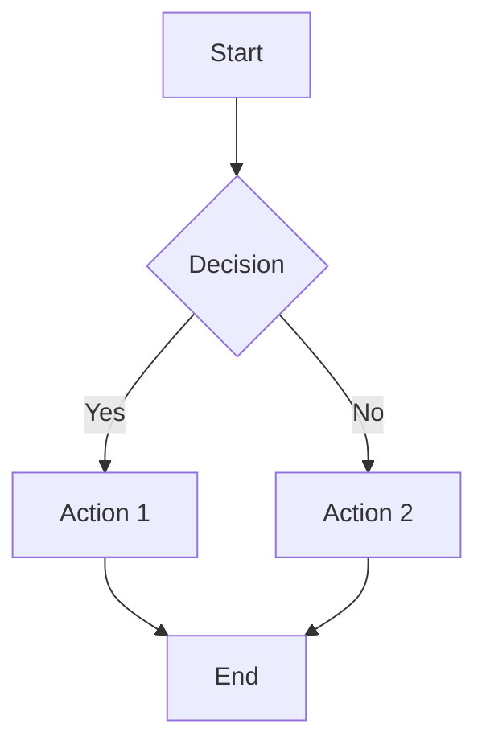
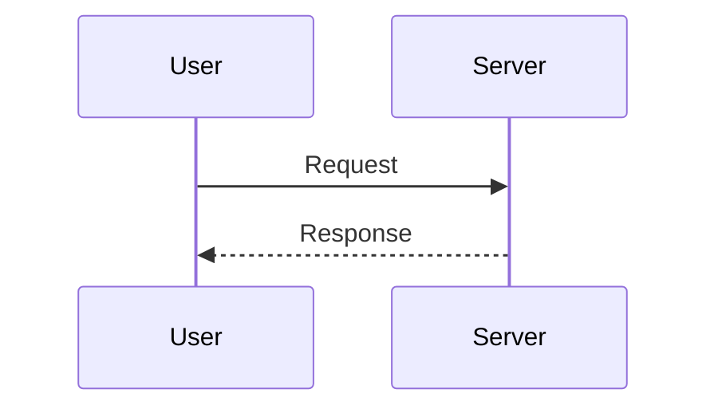
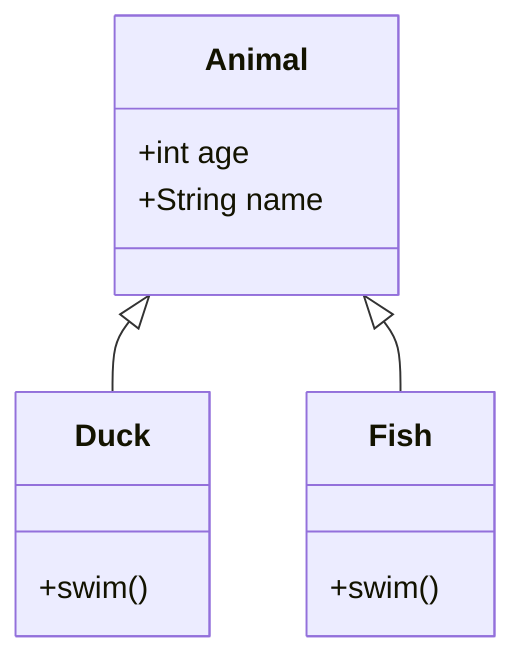

# Mermaid Diagrams

This page tests Mermaid.js diagram rendering.

## Flowchart

```mermaid
graph TD
    A[Start] --> B{Decision}
    B -->|Yes| C[Action 1]
    B -->|No| D[Action 2]
    C --> E[End]
    D --> E
```

## Sequence Diagram

```mermaid
sequenceDiagram
    participant User
    participant Server
    User->>Server: Request
    Server-->>User: Response
```

## Class Diagram

```mermaid
classDiagram
    Animal <|-- Duck
    Animal <|-- Fish
    Animal : +int age
    Animal : +String name
    Duck : +swim()
    Fish : +swim()
```
